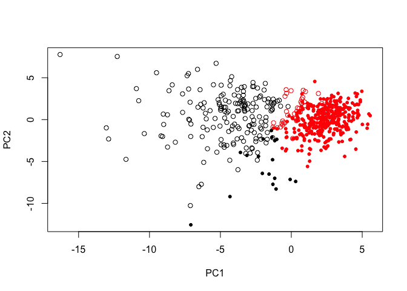

Class10: Machine Learning Project
================
Michael Overton

Using PCA and heirarchical clustering to investigate data from the Wisconsin Breast Cancer Diagnostic Data Set, first reported by K. P. Benne and O. L. Mangasarian: "Robust Linear Programming Discrimination of Two Linearly Inseparable Sets".

``` r
fna.data <- "Class_10_data/WisconsinCancer.csv"
wisc.df <- read.csv(fna.data)
```

Q1. What type of object is returned from the read.csv() function?

``` r
class(wisc.df)
```

    ## [1] "data.frame"

Q2. How many observations (i.e. patients) are in this dataset?

``` r
length(unique(wisc.df$id))
```

    ## [1] 569

Q3. How many of the observations have a malignant diagnosis?

``` r
sum(wisc.df$diagnosis == "M")
```

    ## [1] 212

Q4. How many variables/features in the data are suffixed with \_mean?

``` r
wisc.data <- as.matrix(wisc.df[ ,3:32])
rownames(wisc.data) <- wisc.df$id

length(grep("_mean", colnames(wisc.data)))
```

    ## [1] 10

Q5. Why do you think we are using the indices 3:32 here?

> The specific sample IDs are converted into the rownames, and we want this to be unsupervised, so we do not want to bias our analysis with the final diagnoses, we want to be able to predict malignancy from the data

``` r
diagnosis <- as.vector(wisc.df$diagnosis)
wisc.pr <- prcomp(wisc.data, scale. = T)

summary(wisc.pr)
```

    ## Importance of components:
    ##                           PC1    PC2     PC3     PC4     PC5     PC6     PC7
    ## Standard deviation     3.6444 2.3857 1.67867 1.40735 1.28403 1.09880 0.82172
    ## Proportion of Variance 0.4427 0.1897 0.09393 0.06602 0.05496 0.04025 0.02251
    ## Cumulative Proportion  0.4427 0.6324 0.72636 0.79239 0.84734 0.88759 0.91010
    ##                            PC8    PC9    PC10   PC11    PC12    PC13    PC14
    ## Standard deviation     0.69037 0.6457 0.59219 0.5421 0.51104 0.49128 0.39624
    ## Proportion of Variance 0.01589 0.0139 0.01169 0.0098 0.00871 0.00805 0.00523
    ## Cumulative Proportion  0.92598 0.9399 0.95157 0.9614 0.97007 0.97812 0.98335
    ##                           PC15    PC16    PC17    PC18    PC19    PC20   PC21
    ## Standard deviation     0.30681 0.28260 0.24372 0.22939 0.22244 0.17652 0.1731
    ## Proportion of Variance 0.00314 0.00266 0.00198 0.00175 0.00165 0.00104 0.0010
    ## Cumulative Proportion  0.98649 0.98915 0.99113 0.99288 0.99453 0.99557 0.9966
    ##                           PC22    PC23   PC24    PC25    PC26    PC27    PC28
    ## Standard deviation     0.16565 0.15602 0.1344 0.12442 0.09043 0.08307 0.03987
    ## Proportion of Variance 0.00091 0.00081 0.0006 0.00052 0.00027 0.00023 0.00005
    ## Cumulative Proportion  0.99749 0.99830 0.9989 0.99942 0.99969 0.99992 0.99997
    ##                           PC29    PC30
    ## Standard deviation     0.02736 0.01153
    ## Proportion of Variance 0.00002 0.00000
    ## Cumulative Proportion  1.00000 1.00000

``` r
biplot(wisc.pr)
```


Q10. What stands out to you about this plot? Is it easy or difficult to understand? Why?

> The plot is extremely cluttered, as ID names are used as points rather than some marker. As well, the various factors influencing the data point locations are numerous and the names are cluttered.

``` r
plot(wisc.pr$x, col = (diagnosis=="M")+1, 
     xlab = "PC1", ylab = "PC2")
```


Q11. Generate a PC1 vs PC2 plot as described above colored by diagnosis. What do the points in this plot represent? What are the red points? Where did this coloring come from and why were these colors chosen by R?

> Each point is a particular biopsy result, the red points are malignant diagnoses. By using the conversion of logical to numeric, R looks up the associated colors in a palette to the values 1 and 0 (or actually, 2 and 1, because we add 1 to the logical) which are 1=black and 2=red.

``` r
plot(wisc.pr$x[,c(1,3)], col = (diagnosis=="M")+1, 
     xlab = "PC1", ylab = "PC3")
```


Q12. Generate a similar plot for principal components 1 and 3. What do you notice about these plots?

> PC3 is less informative than PC2. There is less partitioning of the datapoints in PC3

Variance explained In this section, scree plots show the proportion of variance explained as the number of principal components increases. The data from PCA must be prepared for these plots, as there is not a built-in function in base R to create them directly from the PCA model.

``` r
pr.var <- wisc.pr$sdev^2
pve <- pr.var / sum(pr.var)

barplot(pve, ylab = "Precent of Variance Explained",
     names.arg=paste0("PC",1:length(pve)), las=2, axes = FALSE)
axis(2, at=pve, labels=round(pve,2)*100 )
```


``` r
library(factoextra)
```

    ## Loading required package: ggplot2

    ## Welcome! Want to learn more? See two factoextra-related books at https://goo.gl/ve3WBa

``` r
fviz_eig(wisc.pr, addlabels = TRUE)
```


Q13. For the first principal component, and using two significant figures, what is the component of the loading vector (i.e. wisc.pr$rotation\[,1\]) for the feature radius\_mean?

Q14. For the first principal component, and using two significant figures, what is the component of the loading vector (i.e. wisc.pr$rotation\[,1\]) for the feature smoothness\_se?

Q15. Which original variable contributes most to PC1?

``` r
round(wisc.pr$rotation[,1][["radius_mean"]], 2)
```

    ## [1] -0.22

``` r
round(wisc.pr$rotation[,1][["smoothness_se"]], 3)
```

    ## [1] -0.015

``` r
max(abs(wisc.pr$rotation[,1]))
```

    ## [1] 0.2608538

Hierarchical clustering of case data The goal of this section is to do hierarchical clustering of the observations. This type of clustering does not assume in advance the number of natural groups that exist in the data.

As part of the preparation for hierarchical clustering, the distance between all pairs of observations are computed. There are different ways to link clusters together, with single, complete, and average being the most common methods.

Q16. Using the plot() and abline() functions, what is the height at which the clustering model has 4 clusters?

``` r
# Scale the wisc.data data: data.scaled
library(scales)

data.scaled <- rescale(wisc.data)

data.dist <- dist(data.scaled, method="euclidean")
wisc.hclust <- hclust(data.dist, method="ward.D")

plot(wisc.hclust)
abline(a=4.5, b=0, col="red", lty=2)
```


Selecting number of clusters This section compares the outputs from the hierarchical clustering model to the actual diagnoses. Normally when performing unsupervised learning like this, a target variable (i.e. known answer or labels) isn't available. We do have it with this dataset, however, so it can be used to check the performance of the clustering model.

``` r
wisc.k.tbls <- vector("list", 9)
for (i in 2:10) {
  wisc.hclust.k <- cutree(wisc.hclust, k=i)
  wisc.k.tbl <- table(wisc.hclust.k, diagnosis)
  wisc.k.tbls[[i-1]] <- wisc.k.tbl
}
```

The clustering does not fully resolve into Benign and Malignant groups. In particular k=5 results into four well-partitioned goups, but one group that is a mixture.

Q17. Can you find a better cluster vs diagnoses match by cutting into a different number of clusters between 2 and 10? How would you determine what better is in this context? &gt; The k=5 seems to be the point of inflection, where the production of new clusters that segregate along diagnosis essentially ceases.

Clustering with PCA This final section puts together several steps used earlier. The PCA model required significantly fewer features to describe 70%, 80% and 95% of the variability of the data. In addition to normalizing data and potentially avoiding over-fitting, PCA also uncorrelates the variables, sometimes improving the performance of other modeling techniques.

``` r
wisc.hc.pr <- hclust(dist(wisc.pr$x[,1:2]), method="ward.D2")

grps <- cutree(wisc.hc.pr, k=2)

table(grps, diagnosis)
```

    ##     diagnosis
    ## grps   B   M
    ##    1  18 177
    ##    2 339  35

``` r
plot(wisc.pr$x[ ,1:2], col=grps, pch=20+(diagnosis=="M"))
```



``` r
plot(wisc.pr$x[,1:2], col=2-(diagnosis=="M"), pch=20+(diagnosis=="M"))
```


Q18. How well does k-means separate the two diagnoses? How does it compare to your hclust results?

``` r
wisc.km <- kmeans(scale(wisc.data), centers= 2, nstart= 20)
table(wisc.km$cluster, diagnosis)
```

    ##    diagnosis
    ##       B   M
    ##   1  14 175
    ##   2 343  37

> The two methods yield very similar results

``` r
library(rgl)
plot3d(wisc.pr$x[,1:3], xlab="PC 1", ylab="PC 2", zlab="PC 3", cex=1.5, size=1, type="s", col=grps)
rglwidget(width = 400, height = 400)
```


Q19. How well does the newly created model with four clusters separate out the two diagnoses?

``` r
## Use the distance along the first 7 PCs for clustering i.e. wisc.pr$x[, 1:7]
wisc.pr.hclust <- hclust(data.dist, method="ward.D2")

wisc.pr.hclust.clusters <- cutree(wisc.pr.hclust, k=4)
table(wisc.pr.hclust.clusters, diagnosis)
```

    ##                        diagnosis
    ## wisc.pr.hclust.clusters   B   M
    ##                       1   0  75
    ##                       2 260   6
    ##                       3  97 120
    ##                       4   0  11

Q20. How well do the k-means and hierarchical clustering models you created in previous sections (i.e. before PCA) do in terms of separating the diagnoses? Again, use the table() function to compare the output of each model (wisc.km$cluster and wisc.hclust.clusters) with the vector containing the actual diagnoses.

``` r
table(wisc.km$cluster, diagnosis)
```

    ##    diagnosis
    ##       B   M
    ##   1  14 175
    ##   2 343  37

``` r
wisc.k.tbls[[3]]
```

    ##              diagnosis
    ## wisc.hclust.k   B   M
    ##             1   0  83
    ##             2 200   5
    ##             3 156  77
    ##             4   1  47

``` r
table(wisc.pr.hclust.clusters, diagnosis)
```

    ##                        diagnosis
    ## wisc.pr.hclust.clusters   B   M
    ##                       1   0  75
    ##                       2 260   6
    ##                       3  97 120
    ##                       4   0  11

> In this case, the PCA method seems to have performed worse than the heirarchical clustering. While cluster 3 in the PCA method does detect more true negatives, cluster 3 is even more well mixed in the PCA than in the heirarchical model. However, K-means performs the best.

Q21. Which of your analysis procedures resulted in a clustering model with the best specificity? How about sensitivity? PCA is more sensitive, heirarchical is mmore specific.

``` r
url <- "https://tinyurl.com/new-samples-CSV"
new <- read.csv(url)
npc <- predict(wisc.pr, newdata=new)
npc
```

    ##            PC1       PC2        PC3        PC4       PC5        PC6        PC7
    ## [1,]  2.576616 -3.135913  1.3990492 -0.7631950  2.781648 -0.8150185 -0.3959098
    ## [2,] -4.754928 -3.009033 -0.1660946 -0.6052952 -1.140698 -1.2189945  0.8193031
    ##             PC8       PC9       PC10      PC11      PC12      PC13     PC14
    ## [1,] -0.2307350 0.1029569 -0.9272861 0.3411457  0.375921 0.1610764 1.187882
    ## [2,] -0.3307423 0.5281896 -0.4855301 0.7173233 -1.185917 0.5893856 0.303029
    ##           PC15       PC16        PC17        PC18        PC19       PC20
    ## [1,] 0.3216974 -0.1743616 -0.07875393 -0.11207028 -0.08802955 -0.2495216
    ## [2,] 0.1299153  0.1448061 -0.40509706  0.06565549  0.25591230 -0.4289500
    ##            PC21       PC22       PC23       PC24        PC25         PC26
    ## [1,]  0.1228233 0.09358453 0.08347651  0.1223396  0.02124121  0.078884581
    ## [2,] -0.1224776 0.01732146 0.06316631 -0.2338618 -0.20755948 -0.009833238
    ##              PC27        PC28         PC29         PC30
    ## [1,]  0.220199544 -0.02946023 -0.015620933  0.005269029
    ## [2,] -0.001134152  0.09638361  0.002795349 -0.019015820

Q22. Which of these new patients should we prioritize for follow up based on your results?

``` r
plot(wisc.pr$x[,1:2], col=3-grps)
points(npc[,1], npc[,2], col="blue", pch=16, cex=3)
text(npc[,1], npc[,2], c(1,2), col="white")
```


> Patients with a malignant diagnosis are colored red, therefore Patient 2 should follow up.
