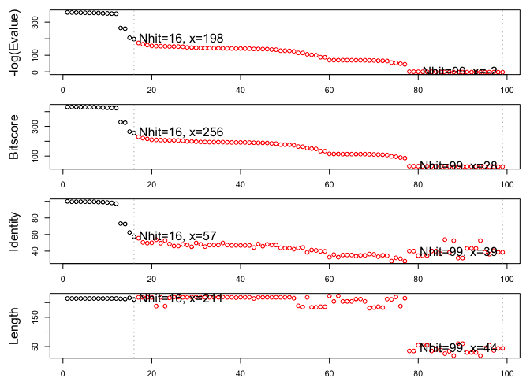
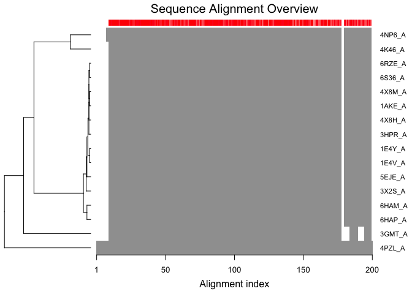
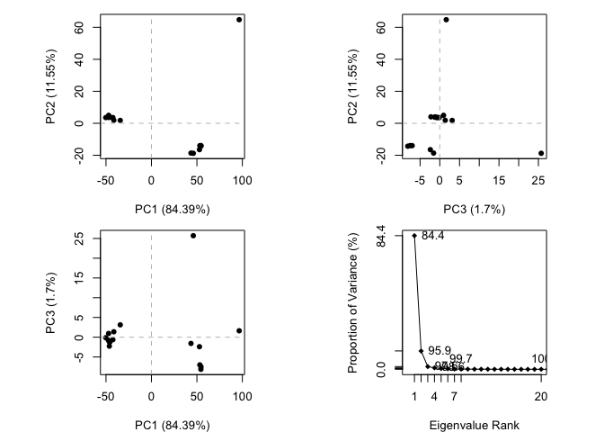
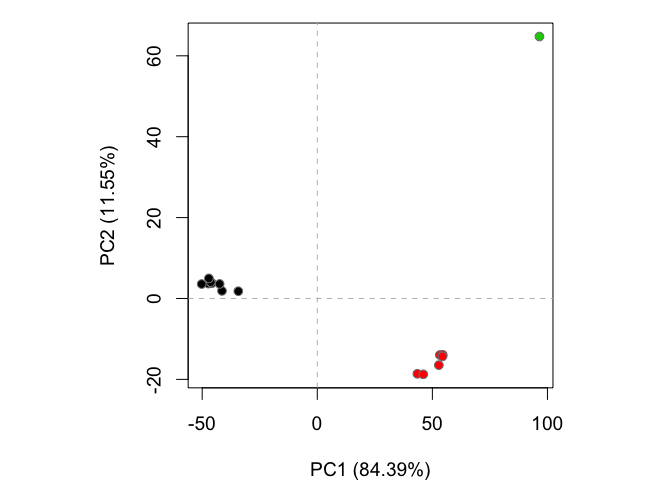
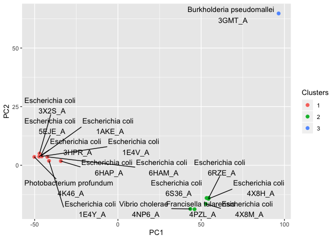
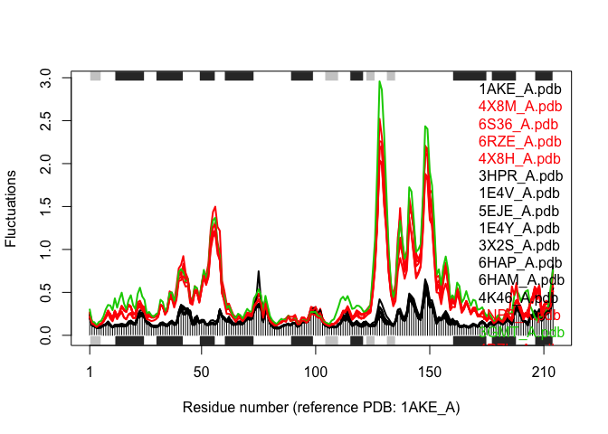

Class12 - Structural Bioinformatics
================
Michael Overton

Look at some statistics from the PDB database

``` r
PDB_stats <- read.csv("PDB_summary.csv")
PDB_stats
```

    ##   Experimental.Method Proteins Nucleic.Acids Protein.NA.Complex Other  Total
    ## 1               X-Ray   133756          2086               6884     8 142734
    ## 2                 NMR    11308          1317                265     8  12898
    ## 3 Electron Microscopy     3241            35               1095     0   4371
    ## 4               Other      284             4                  6    13    307
    ## 5        Multi Method      146             5                  2     1    154

``` r
f_Xray <- PDB_stats[1,"Proteins"]/sum(PDB_stats$Proteins)
f_EM <- PDB_stats[3,"Proteins"]/sum(PDB_stats$Proteins)
f_Prot <- sum(PDB_stats$Proteins)/sum(PDB_stats$Total)
```

Q: What percentage of structures in the PDB are solved by X-Ray and Electron Microscopy? &gt; X-ray=89.9% &gt; EM=2.1%

Q: What proportion of structures in the PDB are protein? &gt; 92.7%

Q: Type HIV in the PDB website search box on the home page and determine how many HIV-1 protease structures are in the current PDB? &gt; 141

Load in the protein sequence of a bacterial adenylate kinase and blast for homologs

``` r
library(bio3d)
library(devtools)
```

    ## Loading required package: usethis

``` r
library(BiocManager)
```

    ## Bioconductor version 3.9 (BiocManager 1.30.10), ?BiocManager::install for help

    ## Bioconductor version '3.9' is out-of-date; the current release version '3.10'
    ##   is available with R version '3.6'; see https://bioconductor.org/install

    ## 
    ## Attaching package: 'BiocManager'

    ## The following object is masked from 'package:devtools':
    ## 
    ##     install

``` r
pdb <- read.pdb("1hsg")
```

    ##   Note: Accessing on-line PDB file

``` r
pdb
```

    ## 
    ##  Call:  read.pdb(file = "1hsg")
    ## 
    ##    Total Models#: 1
    ##      Total Atoms#: 1686,  XYZs#: 5058  Chains#: 2  (values: A B)
    ## 
    ##      Protein Atoms#: 1514  (residues/Calpha atoms#: 198)
    ##      Nucleic acid Atoms#: 0  (residues/phosphate atoms#: 0)
    ## 
    ##      Non-protein/nucleic Atoms#: 172  (residues: 128)
    ##      Non-protein/nucleic resid values: [ HOH (127), MK1 (1) ]
    ## 
    ##    Protein sequence:
    ##       PQITLWQRPLVTIKIGGQLKEALLDTGADDTVLEEMSLPGRWKPKMIGGIGGFIKVRQYD
    ##       QILIEICGHKAIGTVLVGPTPVNIIGRNLLTQIGCTLNFPQITLWQRPLVTIKIGGQLKE
    ##       ALLDTGADDTVLEEMSLPGRWKPKMIGGIGGFIKVRQYDQILIEICGHKAIGTVLVGPTP
    ##       VNIIGRNLLTQIGCTLNF
    ## 
    ## + attr: atom, xyz, seqres, helix, sheet,
    ##         calpha, remark, call

``` r
aa <- get.seq("1ake_A")
```

    ## Warning in get.seq("1ake_A"): Removing existing file: seqs.fasta

    ## Fetching... Please wait. Done.

Plot blast hits and find breakpoint

``` r
b <- blast.pdb(aa)
```

    ##  Searching ... please wait (updates every 5 seconds) RID = 6RPVU1DR014 
    ##  ...........................................................................................................................................................................................................................................................
    ##  Reporting 99 hits

``` r
hits <- plot(b)
```

    ##   * Possible cutoff values:    197 -3 
    ##             Yielding Nhits:    16 99 
    ## 
    ##   * Chosen cutoff value of:    197 
    ##             Yielding Nhits:    16



Load in files of 16 adenylate kinases most closly related to reference and align

``` r
match_files <- get.pdb(hits$pdb.id, path="pdbs", split=T, gzip=T, verbose=F, overwrite=T)
```

    ## 
      |                                                                            
      |                                                                      |   0%
      |                                                                            
      |====                                                                  |   6%
      |                                                                            
      |=========                                                             |  12%
      |                                                                            
      |=============                                                         |  19%
      |                                                                            
      |==================                                                    |  25%
      |                                                                            
      |======================                                                |  31%
      |                                                                            
      |==========================                                            |  38%
      |                                                                            
      |===============================                                       |  44%
      |                                                                            
      |===================================                                   |  50%
      |                                                                            
      |=======================================                               |  56%
      |                                                                            
      |============================================                          |  62%
      |                                                                            
      |================================================                      |  69%
      |                                                                            
      |====================================================                  |  75%
      |                                                                            
      |=========================================================             |  81%
      |                                                                            
      |=============================================================         |  88%
      |                                                                            
      |==================================================================    |  94%
      |                                                                            
      |======================================================================| 100%

``` r
match_pdbs <- pdbaln(match_files, fit = T, exefile="msa")
```

    ## Reading PDB files:
    ## pdbs/split_chain/1AKE_A.pdb
    ## pdbs/split_chain/4X8M_A.pdb
    ## pdbs/split_chain/6S36_A.pdb
    ## pdbs/split_chain/6RZE_A.pdb
    ## pdbs/split_chain/4X8H_A.pdb
    ## pdbs/split_chain/3HPR_A.pdb
    ## pdbs/split_chain/1E4V_A.pdb
    ## pdbs/split_chain/5EJE_A.pdb
    ## pdbs/split_chain/1E4Y_A.pdb
    ## pdbs/split_chain/3X2S_A.pdb
    ## pdbs/split_chain/6HAP_A.pdb
    ## pdbs/split_chain/6HAM_A.pdb
    ## pdbs/split_chain/4K46_A.pdb
    ## pdbs/split_chain/4NP6_A.pdb
    ## pdbs/split_chain/3GMT_A.pdb
    ## pdbs/split_chain/4PZL_A.pdb
    ##    PDB has ALT records, taking A only, rm.alt=TRUE
    ## ..   PDB has ALT records, taking A only, rm.alt=TRUE
    ## .   PDB has ALT records, taking A only, rm.alt=TRUE
    ## ..   PDB has ALT records, taking A only, rm.alt=TRUE
    ## ..   PDB has ALT records, taking A only, rm.alt=TRUE
    ## ....   PDB has ALT records, taking A only, rm.alt=TRUE
    ## .   PDB has ALT records, taking A only, rm.alt=TRUE
    ## ....
    ## 
    ## Extracting sequences
    ## 
    ## pdb/seq: 1   name: pdbs/split_chain/1AKE_A.pdb 
    ##    PDB has ALT records, taking A only, rm.alt=TRUE
    ## pdb/seq: 2   name: pdbs/split_chain/4X8M_A.pdb 
    ## pdb/seq: 3   name: pdbs/split_chain/6S36_A.pdb 
    ##    PDB has ALT records, taking A only, rm.alt=TRUE
    ## pdb/seq: 4   name: pdbs/split_chain/6RZE_A.pdb 
    ##    PDB has ALT records, taking A only, rm.alt=TRUE
    ## pdb/seq: 5   name: pdbs/split_chain/4X8H_A.pdb 
    ## pdb/seq: 6   name: pdbs/split_chain/3HPR_A.pdb 
    ##    PDB has ALT records, taking A only, rm.alt=TRUE
    ## pdb/seq: 7   name: pdbs/split_chain/1E4V_A.pdb 
    ## pdb/seq: 8   name: pdbs/split_chain/5EJE_A.pdb 
    ##    PDB has ALT records, taking A only, rm.alt=TRUE
    ## pdb/seq: 9   name: pdbs/split_chain/1E4Y_A.pdb 
    ## pdb/seq: 10   name: pdbs/split_chain/3X2S_A.pdb 
    ## pdb/seq: 11   name: pdbs/split_chain/6HAP_A.pdb 
    ## pdb/seq: 12   name: pdbs/split_chain/6HAM_A.pdb 
    ##    PDB has ALT records, taking A only, rm.alt=TRUE
    ## pdb/seq: 13   name: pdbs/split_chain/4K46_A.pdb 
    ##    PDB has ALT records, taking A only, rm.alt=TRUE
    ## pdb/seq: 14   name: pdbs/split_chain/4NP6_A.pdb 
    ## pdb/seq: 15   name: pdbs/split_chain/3GMT_A.pdb 
    ## pdb/seq: 16   name: pdbs/split_chain/4PZL_A.pdb

Plot alignment and phylogenetic tree

``` r
ids <- basename.pdb(match_pdbs$id)
plot(match_pdbs, labels=ids)
```



PCA plot of xray structures

``` r
library(bio3d.view)
library(rgl)

anno <- pdb.annotate(ids)
```

    ## Warning in pdb.annotate(ids): ids should be standard 4 character PDB-IDs: trying
    ## first 4 characters...

``` r
unique(anno$source)
```

    ## [1] "Escherichia coli"          "Photobacterium profundum" 
    ## [3] "Vibrio cholerae"           "Burkholderia pseudomallei"
    ## [5] "Francisella tularensis"

``` r
pc.xray <- pca(match_pdbs)
plot(pc.xray)
```



PCA plot of structures using root mean squared distance

``` r
# Calculate RMSD
rd <- rmsd(match_pdbs)
```

    ## Warning in rmsd(match_pdbs): No indices provided, using the 204 non NA positions

``` r
# Structure-based clustering
hc.rd <- hclust(dist(rd))
grps.rd <- cutree(hc.rd, k=3)

plot(pc.xray, 1:2, col="grey50", bg=grps.rd, pch=21, cex=1)
```



A better plot using the ggplot package

``` r
#Plotting results with ggplot2
library(ggplot2)
library(ggrepel)

df <- data.frame(x=pc.xray$z[,1], y=pc.xray$z[,2])
col <- as.factor(grps.rd)

an <- anno$source

p <- ggplot(df, aes(x, y)) +
 geom_point(aes(col=col), size=2) +
 xlab("PC1") +
 ylab("PC2") +
 scale_color_discrete(name="Clusters") +
 geom_text_repel(aes(label=paste(an,"\n",ids)))
p
```



``` r
# Visualize first principal component
pc1 <- mktrj(pc.xray, pc=1, file="pc_1.pdb")

video_files <- list.files("Adenylate_kinase_pc1.mpg",
                         pattern = "\\.mpg$",
                         recursive = TRUE,
                         all.files = FALSE,
                         full.names = TRUE)
```

<iframe width="720" height="480" src="Adenylate_kinase_pc1.mpg" align="middle" frameborder="0" allowfullscreen>
</iframe>
Normal mode analysis of protein strucure to show regions of greatest positional change

``` r
modes <- nma(match_pdbs)
```

    ## 
    ## Details of Scheduled Calculation:
    ##   ... 16 input structures 
    ##   ... storing 606 eigenvectors for each structure 
    ##   ... dimension of x$U.subspace: ( 612x606x16 )
    ##   ... coordinate superposition prior to NM calculation 
    ##   ... aligned eigenvectors (gap containing positions removed)  
    ##   ... estimated memory usage of final 'eNMA' object: 45.4 Mb 
    ## 
    ## 
      |                                                                            
      |                                                                      |   0%
      |                                                                            
      |====                                                                  |   6%
      |                                                                            
      |=========                                                             |  12%
      |                                                                            
      |=============                                                         |  19%
      |                                                                            
      |==================                                                    |  25%
      |                                                                            
      |======================                                                |  31%
      |                                                                            
      |==========================                                            |  38%
      |                                                                            
      |===============================                                       |  44%
      |                                                                            
      |===================================                                   |  50%
      |                                                                            
      |=======================================                               |  56%
      |                                                                            
      |============================================                          |  62%
      |                                                                            
      |================================================                      |  69%
      |                                                                            
      |====================================================                  |  75%
      |                                                                            
      |=========================================================             |  81%
      |                                                                            
      |=============================================================         |  88%
      |                                                                            
      |==================================================================    |  94%
      |                                                                            
      |======================================================================| 100%

``` r
plot(modes, match_pdbs, col=grps.rd)
```

    ## Extracting SSE from pdbs$sse attribute



Q. What do you note about this plot? Are the black and colored lines similar or different? Where do you think they differ most and why? &gt; The three line colors correspond to the three clusters from the PCA plot, specifically where the individual samples are located on PC1. The black lines are similar to each other and the colored lines are similar to each other. The black and colored lines differ most where there are larger structural differences.
