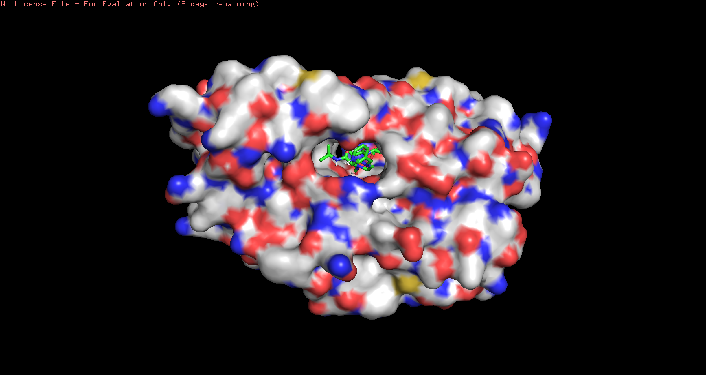

```{r setup, include=FALSE}
knitr::opts_chunk$set(echo = TRUE)
```

We will download and clean up the HIV-Pr structure (1HSG) from PDB. We will make separate lists for "protein-only" and "ligand-only" sets.

```{r}
library(bio3d)

p.file <- get.pdb("1hsg")
hiv <- read.pdb(p.file)
hiv

```


Q1)  What is the name of the two non protein resid values in this structure? What does resid correspond to and how would you get a listing of all reside values in this structure?
  > HOH and MK1 
  > resid is short for residue, which corresponds to the identity to each amino acid in the molecule


Download seperate objects for protein and ligand. Then export .pdb files for manipulation with AutoDocTools
```{r}
prot <- atom.select(hiv, "protein", value=T)
lig <- atom.select(hiv, "ligand", value=T)
write.pdb(prot, file="1hsg_protein.pdb")
write.pdb(lig, file="1hsg_ligand.pdb")
mk1 <- read.pdb("1hsg_ligand.pdb")
mk1
```

Crystal structures normally lack hydrogen atoms. However, hydrogen atoms are required for appropriate treatment of electrostatics during docking, so we will add hydrogen atoms to the protein and ligand structures, and assign charge and atom type, using AutoDocTools (ADT). As well, we will define flexible bonds in the ligand to allow for flexible docking.

Q2: Can you locate the binding site visually? Note that crystal structures normally lack hydrogen atoms, why?
> Yes, the binding site appears to be a hollow region near the center of the folded protein.

Q3: Look at the charges. Does it make sense (e.g. based on your knowledge of the physiochemical properties of amino acids)?
> Yes, much of the interior of the protein is non-polar, which is largely responsible for its globular structure. As well, there are select polar residues within the binding pocket that likely lock onto the ligand and catalyze the reaction.


These new structures are processed by Autodock Vina. Vina searches the position space of the protein and ligand to find minimal free energy arrangents, which indicates likely binding geometries.

In R, we will convert the .pdbqt file into a .pdb file for viewing in PyMol
```{r}
res <- read.pdb("all.pdbqt", multi=TRUE) 
write.pdb(res, "results.pdb")

```



Q4: Qualitatively, how good are the docks? Is the crystal binding mode reproduced? Is it the best conformation according to AutoDock Vina?
> The dock found to be of the lowest modeled free energy looks highly similar to the solved crystal structure on PDB. The other docks have the ligand arranged in many different positions that do not resemble the emperical structure.

To assess the results quantitatively, we will calculate the RMSD (root mean square distance)
between each of the docking results and the known crystal structure using the bio3d package.
```{r}
res <- read.pdb("all.pdbqt", multi=TRUE)
ori <- read.pdb("1hsg_ligand.pdbqt")
MK1_dist <- rmsd(ori, res)

heavy_res <- atom.select(res, string="noh", value=T)
heavy_ori <- atom.select(ori, string="noh", value=T)

res_matrix <- as.matrix(heavy_res[["xyz"]])
ori_matrix <- as.matrix(heavy_ori[["xyz"]])

MK1_heavy_dist <- c()
for (i in 1:nrow(res_matrix)) {
  d <- rmsd(res_matrix[,i], ori_matrix)
  MK1_heavy_dist <- c(MK1_heavy_dist, d)
}
MK1_heavy_dist <- unlist(MK1_dist)
MK1_heavy_dist
```


Q5: Quantitatively how good are the docks? Is the crystal binding mode reproduced within 1Å RMSD for all atoms?
> Again, the "best" arrangement found with Vina closely approximates the emperical structure, within 1 angstrom.

Q6: How would you determine the RMSD for heavy atoms only (i.e. non hydrogen atoms)?
> Shown in the code above.

We can also quantify the degree of movement in the protein using normal mode analysis.
```{r}

pdb <- read.pdb("1HEL")
modes <- nma(pdb)
plot(modes, sse=pdb)

m7 <- mktrj(modes, mode=7, file="nma_7.pdb")
```


```{r}
library("bio3d.view")
view(m7, col=vec2color(rmsf(m7)))

```

