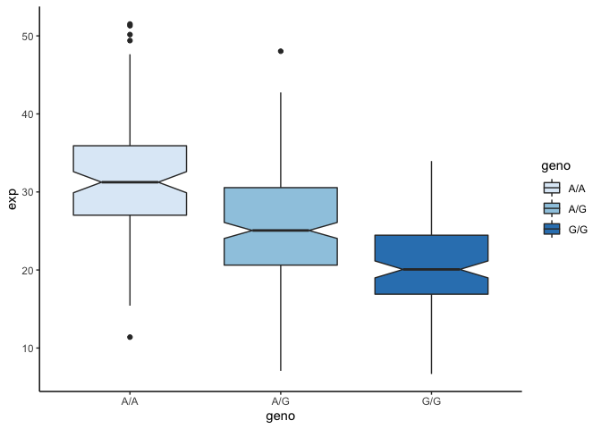
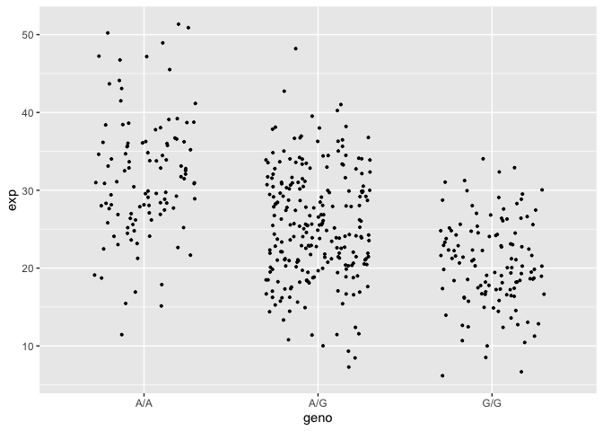
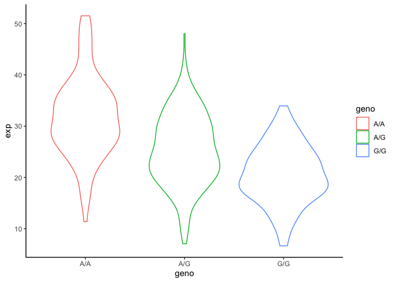

Class\_15\_RNAseq
================
Michael Overton

``` r
mxl <- read.csv("MXL_genotypes.csv")
View(mxl)

table(mxl$Genotype..forward.strand.)
```

    ## 
    ## A|A A|G G|A G|G 
    ##  22  21  12   9

    ## [1] 31.81864

    ## [1] 25.3968

    ## [1] 20.59371


