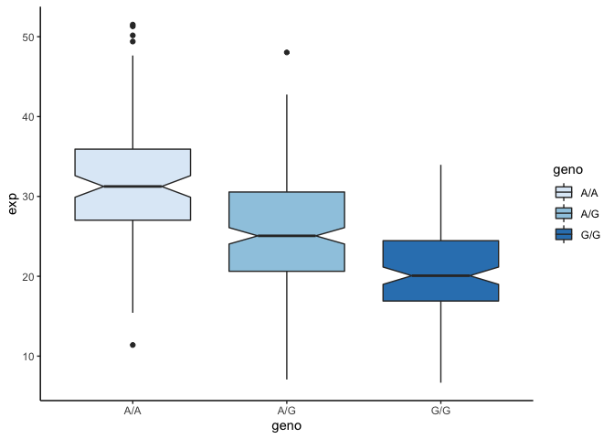

Class\_15\_RNAseq
================
Michael Overton

In this analysis, we will use the Galaxy web-based bioinfromatic tool suite. We will then import processed RNAseq data into R for visualization.

There are a number of gene variants associated with childhood asthma. A study from Verlaan et al. (2009) shows that 4 candidate SNPs demonstrate significant evidence for association. Their functions can be found at OMIM (<http://www.omim.org>) and locating the Verlaan et al. paper description.

Q1: What are those 4 candidate SNPs? &gt; rs12936231, rs8067378, rs9303277, and rs7216389

Q2: What three genes do these variants overlap or effect? &gt; ZPBP2, GSDMB, and ORMDL3

Q3: What is the location of rs8067378 and what are the different alleles for rs8067378? &gt; Chrom 17: 39895095 &gt; A/G variants (43% G)

Q4: What are the downstream genes for rs8067378? Any genes named ZPBP2, GSDMB, and ORMDL3? &gt; Yes, all are present downstream of rs8067378.

``` r
mxl <- read.csv("MXL_genotypes.csv")

table(mxl$Genotype..forward.strand.)
```

    ## 
    ## A|A A|G G|A G|G 
    ##  22  21  12   9

``` r
prop_GG <- table(mxl$Genotype..forward.strand.)["G|G"] / sum(table(mxl$Genotype..forward.strand.))
prop_GG
```

    ##      G|G 
    ## 0.140625

Q5: What proportion of the Mexican Ancestry in Los Angeles sample population (MXL) are homozygous for the asthma associated SNP (G|G)? &gt; 14%

Q6. Back on the ENSEMBLE page, search for the particular sample HG00109. This is a male from the GBR population group. What is the genotype for this sample? &gt; G|G

``` r
library(ggplot2)

geno_SNP1 <- read.table("mxl_geno_expression.txt", sep=" ")

AA <- geno_SNP1[geno_SNP1$geno == "A/A",]
AG <- geno_SNP1[geno_SNP1$geno == "A/G",]
GG <- geno_SNP1[geno_SNP1$geno == "G/G",]

means <- list(AA=mean(AA$exp), AG=mean(AG$exp), GG=mean(GG$exp))
means
```

    ## $AA
    ## [1] 31.81864
    ## 
    ## $AG
    ## [1] 25.3968
    ## 
    ## $GG
    ## [1] 20.59371

``` r
ggplot(geno_SNP1, aes(x=geno, y=exp, fill=geno)) +
  geom_boxplot(notch=T) + scale_fill_brewer(palette="Blues") + theme_classic()
```


Q7: How many sequences are there in the first file? What is the file size and format of the data? &gt; 3863 sequences. The files are ~775kb and in .fastq format

Q8: Does the first sequence have good quality? &gt; Yes, very good quality

Q9: What is the GC content and sequence length of the second fastq file? &gt; GC content = 54% &gt; Sequence lengths = 50-75bp

Q10: How about per base sequence quality? Does any base have a mean quality score below 20? &gt; All basepair quality looks really good.

Q11: Where are most of the accepted hits located? &gt; 38,075,000 and 38,160,000bp

Q13: Cufflinks again produces multiple output files that you can inspect from your right- hand-side galaxy history. From the “gene expression” output, what is the FPKM for the ORMDL3 gene? What are the other genes with above zero FPKM values? &gt; 136853

Q14: Read this file into R and determine the sample size for each genotype and their corresponding median expression levels for each of these genotypes.

``` r
library(tidyverse)
```

    ## ── Attaching packages ─────────────────────────────────────────────────────────────────────────────────── tidyverse 1.3.0 ──

    ## ✓ tibble  2.1.3     ✓ dplyr   0.8.4
    ## ✓ tidyr   1.0.2     ✓ stringr 1.4.0
    ## ✓ readr   1.3.1     ✓ forcats 0.5.0
    ## ✓ purrr   0.3.3

    ## ── Conflicts ────────────────────────────────────────────────────────────────────────────────────── tidyverse_conflicts() ──
    ## x dplyr::filter() masks stats::filter()
    ## x dplyr::lag()    masks stats::lag()

``` r
rs_GT <- read.table("rs8067378_GT.txt")

table(rs_GT$geno)
```

    ## 
    ## A/A A/G G/G 
    ## 108 233 121

``` r
median_exp <- rs_GT %>%
  group_by(geno) %>%
  summarize(med_exp = median(exp, na.rm = TRUE))
median_exp
```

    ## # A tibble: 3 x 2
    ##   geno  med_exp
    ##   <fct>   <dbl>
    ## 1 A/A      31.2
    ## 2 A/G      25.1
    ## 3 G/G      20.1

Q15: Generate a boxplot with a box per genotype, what could you infer from the relative expression value between A/A and G/G displayed in this plot? Does the SNP effect the expression of ORMDL3?

``` r
ggplot(rs_GT, aes(x=geno, y=exp, fill=geno)) +
  geom_boxplot(notch=T) + scale_fill_brewer(palette="Blues") + theme_classic()
```


