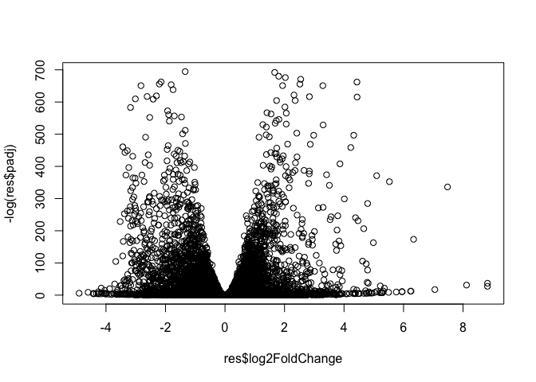

Class\_16-Gene-expression-analysis
================

The data for for hands-on session comes from GEO entry: GSE37704, which is associated with the following publication:

Trapnell C, Hendrickson DG, Sauvageau M, Goff L et al. "Differential analysis of gene regulation at transcript resolution with RNA-seq". Nat Biotechnol 2013 Jan;31(1):46-53. PMID: 23222703 The authors report on differential analysis of lung fibroblasts in response to loss of the developmental transcription factor HOXA1. Their results and others indicate that HOXA1 is required for lung fibroblast and HeLa cell cycle progression. In particular their analysis show that "loss of HOXA1 results in significant expression level changes in thousands of individual transcripts, along with isoform switching events in key regulators of the cell cycle". For our session we have used their Sailfish gene-level estimated counts and hence are restricted to protein-coding genes only.

``` r
count_data <- read.csv("GSE37704_featurecounts.csv", row.names=1)
colData <- read.csv("GSE37704_metadata.csv")

count_data <- count_data[,-1]

dim(count_data)
```

    ## [1] 19808     6

``` r
# Are there any genes (rows) for which data is missing?

count_data_fltr <- count_data[rowSums(count_data) != 0,]
dim(count_data_fltr)
```

    ## [1] 15975     6

``` r
dds = DESeqDataSetFromMatrix(countData=count_data_fltr,
                             colData=colData,
                             design=~condition)
dds = DESeq(dds)
```

    ## estimating size factors

    ## estimating dispersions

    ## gene-wise dispersion estimates

    ## mean-dispersion relationship

    ## final dispersion estimates

    ## fitting model and testing

``` r
res <- results(dds)
summary(res)
```

    ## 
    ## out of 15975 with nonzero total read count
    ## adjusted p-value < 0.1
    ## LFC > 0 (up)       : 4349, 27%
    ## LFC < 0 (down)     : 4396, 28%
    ## outliers [1]       : 0, 0%
    ## low counts [2]     : 1237, 7.7%
    ## (mean count < 0)
    ## [1] see 'cooksCutoff' argument of ?results
    ## [2] see 'independentFiltering' argument of ?results

``` r
plot( res$log2FoldChange, -log(res$padj) )
```



``` r
# Make a color vector for all genes
mycols <- rep("gray", nrow(res) )
# Color red the genes with absolute fold change above 2
mycols[ abs(res$log2FoldChange) > 2 ] <- "red"
# Color blue those with adjusted p-value less than 0.01
#  and absolute fold change more than 2
inds <- (res$padj < 0.01 & (abs(res$log2FoldChange) > 2 ))
mycols[ inds ] <- "blue"
plot( res$log2FoldChange, -log(res$padj), col=mycols, xlab="Log2(FoldChange)", ylab="-Log(P-value)" )
```


``` r
library("AnnotationDbi")
library("org.Hs.eg.db")
```

    ## 

``` r
columns(org.Hs.eg.db)
```

    ##  [1] "ACCNUM"       "ALIAS"        "ENSEMBL"      "ENSEMBLPROT"  "ENSEMBLTRANS"
    ##  [6] "ENTREZID"     "ENZYME"       "EVIDENCE"     "EVIDENCEALL"  "GENENAME"    
    ## [11] "GO"           "GOALL"        "IPI"          "MAP"          "OMIM"        
    ## [16] "ONTOLOGY"     "ONTOLOGYALL"  "PATH"         "PFAM"         "PMID"        
    ## [21] "PROSITE"      "REFSEQ"       "SYMBOL"       "UCSCKG"       "UNIGENE"     
    ## [26] "UNIPROT"

``` r
res$symbol = mapIds(org.Hs.eg.db,
                    keys=row.names(res), 
                    keytype="ENSEMBL",
                    column="SYMBOL",
                    multiVals="first")
```

    ## 'select()' returned 1:many mapping between keys and columns

``` r
res$entrez = mapIds(org.Hs.eg.db,
                    keys=row.names(res),
                    keytype="ENSEMBL",
                    column="ENTREZID",
                    multiVals="first")
```

    ## 'select()' returned 1:many mapping between keys and columns

``` r
res$name =   mapIds(org.Hs.eg.db,
                    keys=row.names(res),
                    keytype="ENSEMBL",
                    column="GENENAME",
                    multiVals="first")
```

    ## 'select()' returned 1:many mapping between keys and columns

``` r
head(res, 10)
```

    ## log2 fold change (MLE): condition hoxa1 kd vs control sirna 
    ## Wald test p-value: condition hoxa1 kd vs control sirna 
    ## DataFrame with 10 rows and 9 columns
    ##                          baseMean     log2FoldChange              lfcSE
    ##                         <numeric>          <numeric>          <numeric>
    ## ENSG00000279457  29.9135794276176  0.179257083672691  0.324821565250145
    ## ENSG00000187634  183.229649921658   0.42645711840331  0.140265820376891
    ## ENSG00000188976  1651.18807619944 -0.692720464846371 0.0548465415913881
    ## ENSG00000187961  209.637938486147  0.729755610585229  0.131859899969346
    ## ENSG00000187583  47.2551232589398 0.0405765278756319  0.271892808601774
    ## ENSG00000187642  11.9797501642461  0.542810491577362  0.521559849534146
    ## ENSG00000188290  108.922127976716    2.0570638345631  0.196905312993835
    ## ENSG00000187608   350.71686801731  0.257383686481775  0.102726560033547
    ## ENSG00000188157    9128.439421961  0.389908792022771 0.0467163395511497
    ## ENSG00000237330 0.158192358990472  0.785955208142751    4.0804728567969
    ##                              stat               pvalue                 padj
    ##                         <numeric>            <numeric>            <numeric>
    ## ENSG00000279457 0.551863246932652    0.581042050747029    0.686554777832896
    ## ENSG00000187634  3.04034951107426  0.00236303749730955  0.00515718149494272
    ## ENSG00000188976 -12.6301576133497  1.4398954015367e-36 1.76548905389749e-35
    ## ENSG00000187961  5.53432552849562 3.12428248077692e-08 1.13412993107612e-07
    ## ENSG00000187583  0.14923722361139    0.881366448669145    0.919030615571379
    ## ENSG00000187642  1.04074439790984    0.297994191720984     0.40337930975409
    ## ENSG00000188290   10.446969679419 1.51281875407292e-25 1.30538189681069e-24
    ## ENSG00000187608  2.50552229528295   0.0122270689409891   0.0237452288908021
    ## ENSG00000188157  8.34630443585717 7.04321148771393e-17 4.21962808560682e-16
    ## ENSG00000237330 0.192613757210411    0.847261469988086                   NA
    ##                      symbol      entrez
    ##                 <character> <character>
    ## ENSG00000279457          NA          NA
    ## ENSG00000187634      SAMD11      148398
    ## ENSG00000188976       NOC2L       26155
    ## ENSG00000187961      KLHL17      339451
    ## ENSG00000187583     PLEKHN1       84069
    ## ENSG00000187642       PERM1       84808
    ## ENSG00000188290        HES4       57801
    ## ENSG00000187608       ISG15        9636
    ## ENSG00000188157        AGRN      375790
    ## ENSG00000237330      RNF223      401934
    ##                                                                     name
    ##                                                              <character>
    ## ENSG00000279457                                                       NA
    ## ENSG00000187634                 sterile alpha motif domain containing 11
    ## ENSG00000188976 NOC2 like nucleolar associated transcriptional repressor
    ## ENSG00000187961                              kelch like family member 17
    ## ENSG00000187583                 pleckstrin homology domain containing N1
    ## ENSG00000187642             PPARGC1 and ESRR induced regulator, muscle 1
    ## ENSG00000188290                   hes family bHLH transcription factor 4
    ## ENSG00000187608                            ISG15 ubiquitin like modifier
    ## ENSG00000188157                                                    agrin
    ## ENSG00000237330                                  ring finger protein 223

``` r
res = res[order(res$pvalue),]
write.csv(res, file ="deseq_results.csv")
```

``` r
library(pathview)
```

    ## ##############################################################################
    ## Pathview is an open source software package distributed under GNU General
    ## Public License version 3 (GPLv3). Details of GPLv3 is available at
    ## http://www.gnu.org/licenses/gpl-3.0.html. Particullary, users are required to
    ## formally cite the original Pathview paper (not just mention it) in publications
    ## or products. For details, do citation("pathview") within R.
    ## 
    ## The pathview downloads and uses KEGG data. Non-academic uses may require a KEGG
    ## license agreement (details at http://www.kegg.jp/kegg/legal.html).
    ## ##############################################################################

``` r
library(gage)
library(gageData)

data(kegg.sets.hs)
data(sigmet.idx.hs)

# Focus on signaling and metabolic pathways only
kegg.sets.hs = kegg.sets.hs[sigmet.idx.hs]

# Examine the first 3 pathways
head(kegg.sets.hs, 3)
```

    ## $`hsa00232 Caffeine metabolism`
    ## [1] "10"   "1544" "1548" "1549" "1553" "7498" "9"   
    ## 
    ## $`hsa00983 Drug metabolism - other enzymes`
    ##  [1] "10"     "1066"   "10720"  "10941"  "151531" "1548"   "1549"   "1551"  
    ##  [9] "1553"   "1576"   "1577"   "1806"   "1807"   "1890"   "221223" "2990"  
    ## [17] "3251"   "3614"   "3615"   "3704"   "51733"  "54490"  "54575"  "54576" 
    ## [25] "54577"  "54578"  "54579"  "54600"  "54657"  "54658"  "54659"  "54963" 
    ## [33] "574537" "64816"  "7083"   "7084"   "7172"   "7363"   "7364"   "7365"  
    ## [41] "7366"   "7367"   "7371"   "7372"   "7378"   "7498"   "79799"  "83549" 
    ## [49] "8824"   "8833"   "9"      "978"   
    ## 
    ## $`hsa00230 Purine metabolism`
    ##   [1] "100"    "10201"  "10606"  "10621"  "10622"  "10623"  "107"    "10714" 
    ##   [9] "108"    "10846"  "109"    "111"    "11128"  "11164"  "112"    "113"   
    ##  [17] "114"    "115"    "122481" "122622" "124583" "132"    "158"    "159"   
    ##  [25] "1633"   "171568" "1716"   "196883" "203"    "204"    "205"    "221823"
    ##  [33] "2272"   "22978"  "23649"  "246721" "25885"  "2618"   "26289"  "270"   
    ##  [41] "271"    "27115"  "272"    "2766"   "2977"   "2982"   "2983"   "2984"  
    ##  [49] "2986"   "2987"   "29922"  "3000"   "30833"  "30834"  "318"    "3251"  
    ##  [57] "353"    "3614"   "3615"   "3704"   "377841" "471"    "4830"   "4831"  
    ##  [65] "4832"   "4833"   "4860"   "4881"   "4882"   "4907"   "50484"  "50940" 
    ##  [73] "51082"  "51251"  "51292"  "5136"   "5137"   "5138"   "5139"   "5140"  
    ##  [81] "5141"   "5142"   "5143"   "5144"   "5145"   "5146"   "5147"   "5148"  
    ##  [89] "5149"   "5150"   "5151"   "5152"   "5153"   "5158"   "5167"   "5169"  
    ##  [97] "51728"  "5198"   "5236"   "5313"   "5315"   "53343"  "54107"  "5422"  
    ## [105] "5424"   "5425"   "5426"   "5427"   "5430"   "5431"   "5432"   "5433"  
    ## [113] "5434"   "5435"   "5436"   "5437"   "5438"   "5439"   "5440"   "5441"  
    ## [121] "5471"   "548644" "55276"  "5557"   "5558"   "55703"  "55811"  "55821" 
    ## [129] "5631"   "5634"   "56655"  "56953"  "56985"  "57804"  "58497"  "6240"  
    ## [137] "6241"   "64425"  "646625" "654364" "661"    "7498"   "8382"   "84172" 
    ## [145] "84265"  "84284"  "84618"  "8622"   "8654"   "87178"  "8833"   "9060"  
    ## [153] "9061"   "93034"  "953"    "9533"   "954"    "955"    "956"    "957"   
    ## [161] "9583"   "9615"

``` r
foldchanges = res$log2FoldChange
names(foldchanges) = res$entrez
head(foldchanges)
```

    ##      1266     54855      1465     51232      2034      2317 
    ## -2.422719  3.201955 -2.313738 -2.059631 -1.888019 -1.649792

``` r
# Get the results
keggres = gage(foldchanges, gsets=kegg.sets.hs)

attributes(keggres)
```

    ## $names
    ## [1] "greater" "less"    "stats"

``` r
head(keggres$less)
```

    ##                                          p.geomean stat.mean        p.val
    ## hsa04110 Cell cycle                   8.995727e-06 -4.378644 8.995727e-06
    ## hsa03030 DNA replication              9.424076e-05 -3.951803 9.424076e-05
    ## hsa03013 RNA transport                1.375901e-03 -3.028500 1.375901e-03
    ## hsa03440 Homologous recombination     3.066756e-03 -2.852899 3.066756e-03
    ## hsa04114 Oocyte meiosis               3.784520e-03 -2.698128 3.784520e-03
    ## hsa00010 Glycolysis / Gluconeogenesis 8.961413e-03 -2.405398 8.961413e-03
    ##                                             q.val set.size         exp1
    ## hsa04110 Cell cycle                   0.001448312      121 8.995727e-06
    ## hsa03030 DNA replication              0.007586381       36 9.424076e-05
    ## hsa03013 RNA transport                0.073840037      144 1.375901e-03
    ## hsa03440 Homologous recombination     0.121861535       28 3.066756e-03
    ## hsa04114 Oocyte meiosis               0.121861535      102 3.784520e-03
    ## hsa00010 Glycolysis / Gluconeogenesis 0.212222694       53 8.961413e-03

``` r
pathview(gene.data=foldchanges, pathway.id="hsa04110")
```

    ## 'select()' returned 1:1 mapping between keys and columns

    ## Info: Working in directory /Users/Mastermind/Desktop/All_Things_School/UCSD/Courses/BGGN213/BGGN213_GITHUB/Class_16-GO_annotation

    ## Info: Writing image file hsa04110.pathview.png

``` r
keggrespathways <- rownames(keggres$greater)[1:5]
# Extract the 8 character long IDs part of each string
keggresids = substr(keggrespathways, start=1, stop=8)

pathview(gene.data=foldchanges, pathway.id=keggresids, species="hsa")
```

    ## 'select()' returned 1:1 mapping between keys and columns

    ## Info: Working in directory /Users/Mastermind/Desktop/All_Things_School/UCSD/Courses/BGGN213/BGGN213_GITHUB/Class_16-GO_annotation

    ## Info: Writing image file hsa04640.pathview.png

    ## 'select()' returned 1:1 mapping between keys and columns

    ## Info: Working in directory /Users/Mastermind/Desktop/All_Things_School/UCSD/Courses/BGGN213/BGGN213_GITHUB/Class_16-GO_annotation

    ## Info: Writing image file hsa04630.pathview.png

    ## 'select()' returned 1:1 mapping between keys and columns

    ## Info: Working in directory /Users/Mastermind/Desktop/All_Things_School/UCSD/Courses/BGGN213/BGGN213_GITHUB/Class_16-GO_annotation

    ## Info: Writing image file hsa00140.pathview.png

    ## 'select()' returned 1:1 mapping between keys and columns

    ## Info: Working in directory /Users/Mastermind/Desktop/All_Things_School/UCSD/Courses/BGGN213/BGGN213_GITHUB/Class_16-GO_annotation

    ## Info: Writing image file hsa04142.pathview.png

    ## Info: some node width is different from others, and hence adjusted!

    ## 'select()' returned 1:1 mapping between keys and columns

    ## Info: Working in directory /Users/Mastermind/Desktop/All_Things_School/UCSD/Courses/BGGN213/BGGN213_GITHUB/Class_16-GO_annotation

    ## Info: Writing image file hsa04330.pathview.png

``` r
keggrespathways <- rownames(keggres$less)[1:5]
# Extract the 8 character long IDs part of each string
keggresids = substr(keggrespathways, start=1, stop=8)

pathview(gene.data=foldchanges, pathway.id=keggresids, species="hsa")
```

    ## 'select()' returned 1:1 mapping between keys and columns

    ## Info: Working in directory /Users/Mastermind/Desktop/All_Things_School/UCSD/Courses/BGGN213/BGGN213_GITHUB/Class_16-GO_annotation

    ## Info: Writing image file hsa04110.pathview.png

    ## 'select()' returned 1:1 mapping between keys and columns

    ## Info: Working in directory /Users/Mastermind/Desktop/All_Things_School/UCSD/Courses/BGGN213/BGGN213_GITHUB/Class_16-GO_annotation

    ## Info: Writing image file hsa03030.pathview.png

    ## 'select()' returned 1:1 mapping between keys and columns

    ## Info: Working in directory /Users/Mastermind/Desktop/All_Things_School/UCSD/Courses/BGGN213/BGGN213_GITHUB/Class_16-GO_annotation

    ## Info: Writing image file hsa03013.pathview.png

    ## 'select()' returned 1:1 mapping between keys and columns

    ## Info: Working in directory /Users/Mastermind/Desktop/All_Things_School/UCSD/Courses/BGGN213/BGGN213_GITHUB/Class_16-GO_annotation

    ## Info: Writing image file hsa03440.pathview.png

    ## 'select()' returned 1:1 mapping between keys and columns

    ## Info: Working in directory /Users/Mastermind/Desktop/All_Things_School/UCSD/Courses/BGGN213/BGGN213_GITHUB/Class_16-GO_annotation

    ## Info: Writing image file hsa04114.pathview.png
