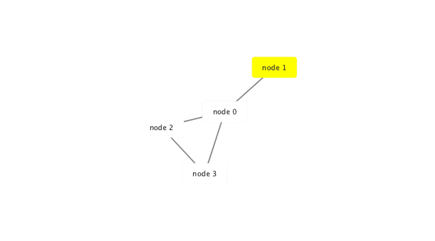
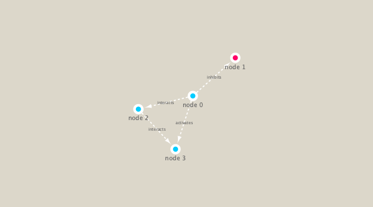

```{r setup, include=FALSE}
knitr::opts_chunk$set(echo = F)
```


```{r}
library(RCy3)
library(igraph)
library(RColorBrewer)

# Test the connection to Cytoscape.
cytoscapePing()
# Check version
cytoscapeVersionInfo()

g <- makeSimpleIgraph()
createNetworkFromIgraph(g,"myGraph")

fig <- exportImage(filename="demo", type="png", height=350)


setVisualStyle("Marquee")

fig <- exportImage(filename="demo_marquee", type="png", height=350)



getVisualStyleNames()
setVisualStyle("Nested Network Style")

```


```{r}
## scripts for processing located in "inst/data-raw/"
prok_vir_cor <- read.delim("./data/virus_prok_cor_abundant.tsv", stringsAsFactors = FALSE)

## Have a peak at the first 6 rows
head(prok_vir_cor)

g <- graph.data.frame(prok_vir_cor, directed = FALSE)
class(g)

plot(g, vertex.size=3, vertex.label=NA)

createNetworkFromIgraph(g,"myIgraph")

cb <- cluster_edge_betweenness(g)
plot(cb, y=g, vertex.label=NA,  vertex.size=3)
```


```{r}

head( membership(cb) )

d <- degree(g)
hist(d, breaks=30, col="lightblue", main ="Node Degree Distribution")
plot( degree_distribution(g), type="h" )

pr <- page_rank(g)
head(pr$vector)

# Make a size vector btwn 2 and 20 for node plotting size
v.size <- BBmisc::normalize(pr$vector, range=c(2,20), method="range")
plot(g, vertex.size=v.size, vertex.label=NA)
```

