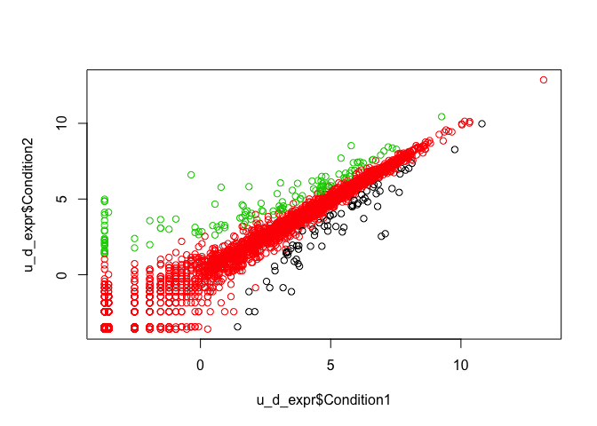
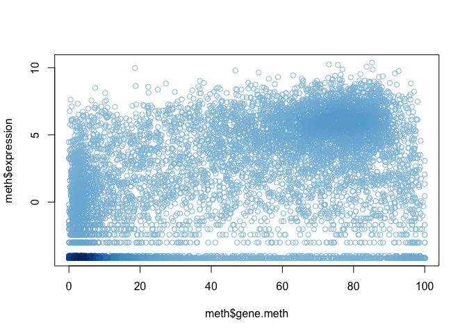

Class\_5-DataVis
================
Michael Overton

Plot baby age against weight 

Counts of genomic features

Counts of different types of transcripts - Dot chart 

Counts of different types of transcripts - Barplot 

Male and female counts with rainbow colors in plot

Gene expression profile with table of number of genes that have changed significantly

    ## 
    ##       down unchanging         up 
    ##         72       4997        127

Plot change in expression under two conditions 

methylation data
================

head(meth) nrow(meth)

Plot methylation state and gene expression 

Plot with coloring by density 

Subset data by expression change &gt; 0 and plot methylation state vs. gene expression 

Plot with more drastic colors 
