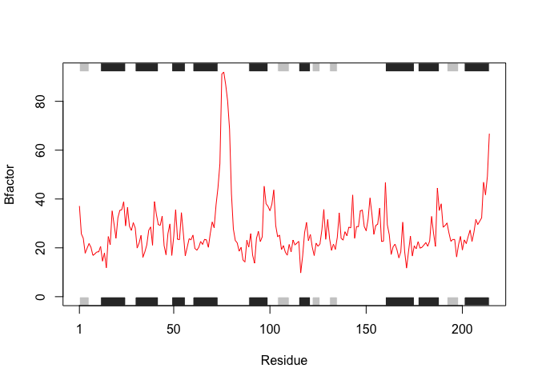
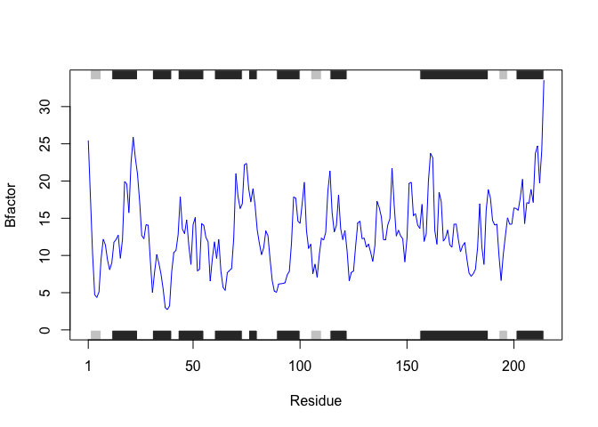
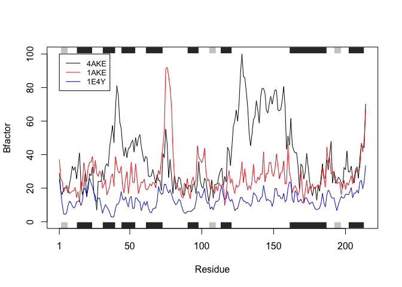

Class\_6-R\_functions
================
Michael Overton

Working with bio3d package First, we installed the bio3d package using install.packages(), then loaded it using library() The below code is copied from the BGGN213 worksheet. It downloads .pdb protein structure files, trims them to only include chain A, and plots the B-factor of each. However it does contain errors, which I have corrected

The protein we are studying is adenylate kinase from E. coli. There are three structures: <br> 4AKE WT adenylate kinase without drug <br> 1AKE kinase bound to AP5 <br> 1E4Y P9L mutant bound to AP5 <br>

We download and manipulate the pdb files to generate a plot of the B-factor across the protein sequence. The B-factor is a measure of the flexibility of the protein as a function of the displacement of the atom position from the mean

``` r
library(bio3d)

s1 <- read.pdb("4AKE")
```

    ##   Note: Accessing on-line PDB file

``` r
s2 <- read.pdb("1AKE")
```

    ##   Note: Accessing on-line PDB file
    ##    PDB has ALT records, taking A only, rm.alt=TRUE

``` r
s3 <- read.pdb("1E4Y")
```

    ##   Note: Accessing on-line PDB file

``` r
s1.chainA <- trim.pdb(s1, chain="A", elety="CA")
s2.chainA <- trim.pdb(s2, chain="A", elety="CA")
s3.chainA <- trim.pdb(s3, chain="A", elety="CA")

s1.b <- s1.chainA$atom$b
s2.b <- s2.chainA$atom$b
s3.b <- s3.chainA$atom$b

plotb3(s1.b, sse=s1.chainA, typ="l", ylab="Bfactor")
```


``` r
plotb3(s2.b, sse=s2.chainA, typ="l", col="red", ylab="Bfactor")
```



``` r
plotb3(s3.b, sse=s3.chainA, typ="l", col="blue", ylab="Bfactor")
```



``` r
plotb3(s1.b, sse=s1.chainA, typ="l", ylab="Bfactor")
points(s2.b, typ="l", col="red")
points(s3.b, typ="l", col="blue")
legend(1, 100, legend=c(s1$call$file, s2$call$file, s3$call$file),
       col=c("black", "red", "blue"), lty=1, cex=0.8)
```



The above code works fine, but lets see if we can improve it

Inputs include a list of PDB codes, which the function can use to download protein information from the PDB database, as well as the protein chain to focus on and the elety

``` r
PDB_codes <- list("4AKE", "1AKE", "1E4Y")
protein_chain = "A"
protein_elety = "CA"
```

The Bfactor\_plot function takes in the above inputs, downloads the data, organizes them into a list, and plots the B-factors for each protein on the same plot. It can accomodate up to 7 protein files.

``` r
Bfactor_plot <- function(codes, chain="A", elety="CA") {
  # Read in list of protein files
  p_list <- lapply(codes, function(p) read.pdb(p))
  # The list is manipulated with the lapply function to parse the protein data based on the chain and elety desired.
  p_list <- lapply(p_list, function(p) trim.pdb(p, chain=chain, elety=elety))
  # A color palette is created to make the plot lines distinguishable
  col_pal <- data.frame(num=c(1:7), col=c("black", "red", "blue", "green", "purple", "orange", "brown"), 
                        stringsAsFactors = F)
  # Create vector of PDB IDs for plot legend
  p_names <- unlist(codes)
  # Protein Bfactor data is plotted with secondary structure. Each color representing a different protein.
  plotb3(p_list[[1]]$atom$b, sse=p_list[[1]], typ="l", ylab="Bfactor")
  for (i in 2:length(p_list)){
    p_names <- c(p_names,p_list[[i]]$call$file)
    points(p_list[[i]]$atom$b, typ="l", col=col_pal[i,2])
  }
  legend(1, 100, legend=p_names,
       col=col_pal[1:length(p_list),2], lty=1, cex=0.8)
}
```

Running the Bfactor\_plot function on the data results in the following plot

    ##   Note: Accessing on-line PDB file

    ## Warning in get.pdb(file, path = tempdir(), verbose = FALSE): /var/folders/t9/
    ## lzlkpj05457_jnpp_ylxglkc0000gn/T//RtmpQejIPF/4AKE.pdb exists. Skipping download

    ##   Note: Accessing on-line PDB file

    ## Warning in get.pdb(file, path = tempdir(), verbose = FALSE): /var/folders/t9/
    ## lzlkpj05457_jnpp_ylxglkc0000gn/T//RtmpQejIPF/1AKE.pdb exists. Skipping download

    ##    PDB has ALT records, taking A only, rm.alt=TRUE
    ##   Note: Accessing on-line PDB file

    ## Warning in get.pdb(file, path = tempdir(), verbose = FALSE): /var/folders/t9/
    ## lzlkpj05457_jnpp_ylxglkc0000gn/T//RtmpQejIPF/1E4Y.pdb exists. Skipping download


