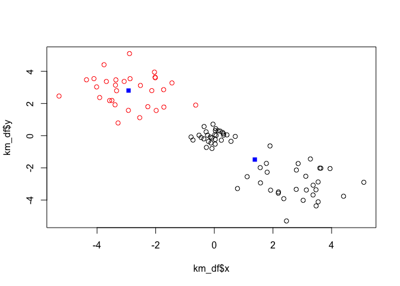
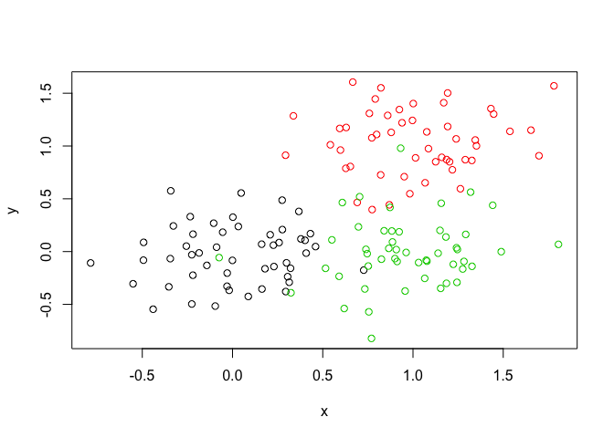
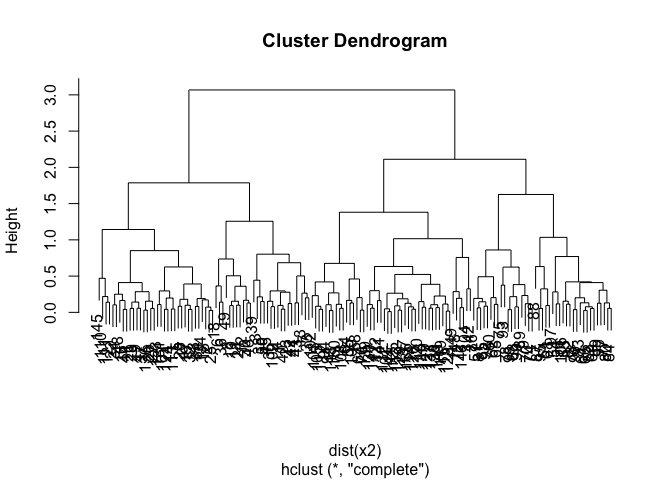
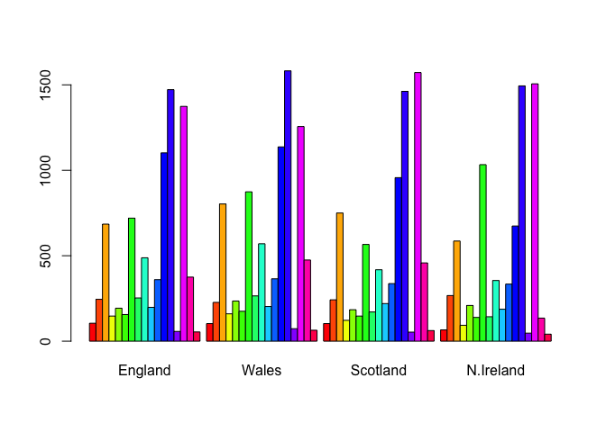
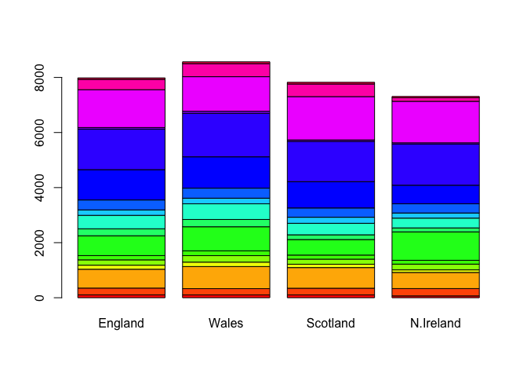

Lecture\_9-Unsupervised\_Learning
================
Michael Overton

K-means clustering
------------------

We will try to cluster randomly generated data using the kmeans() function

``` r
tmp_data <- c(rnorm(30,-3), rnorm(30,0,0.4), rnorm(30,3))
x <- cbind(x=tmp_data, y=rev(tmp_data))
plot(x)
```


Use the kmeans() function setting k to 2 and nstart=20 Inspect/print the results Q. What is in the output object?

``` r
km_2 <- kmeans(x, 2, 30)
km_3 <- kmeans(x, 3, 30)

attributes(km_2)
```

    ## $names
    ## [1] "cluster"      "centers"      "totss"        "withinss"     "tot.withinss"
    ## [6] "betweenss"    "size"         "iter"         "ifault"      
    ## 
    ## $class
    ## [1] "kmeans"

``` r
str(km_2)
```

    ## List of 9
    ##  $ cluster     : int [1:90] 2 2 2 2 2 2 2 2 2 2 ...
    ##  $ centers     : num [1:2, 1:2] 1.38 -2.93 -1.48 2.8
    ##   ..- attr(*, "dimnames")=List of 2
    ##   .. ..$ : chr [1:2] "1" "2"
    ##   .. ..$ : chr [1:2] "x" "y"
    ##  $ totss       : num 1106
    ##  $ withinss    : num [1:2] 310.6 57.4
    ##  $ tot.withinss: num 368
    ##  $ betweenss   : num 738
    ##  $ size        : int [1:2] 60 30
    ##  $ iter        : int 1
    ##  $ ifault      : int 0
    ##  - attr(*, "class")= chr "kmeans"

Q. How many points are in each cluster? &gt; for k=2 : 30 and 60 &gt; for k=3 : 29, 29, and 32

Q. What ‘component’ of your result object details

-   cluster size?

> the $size component

``` r
km_2$size
```

    ## [1] 60 30

``` r
km_3$size
```

    ## [1] 32 29 29

-   cluster assignment/membership?

> the $cluster component

``` r
km_2$cluster
```

    ##  [1] 2 2 2 2 2 2 2 2 2 2 2 2 2 2 2 2 2 2 2 2 2 2 2 2 2 2 2 2 2 2 1 1 1 1 1 1 1 1
    ## [39] 1 1 1 1 1 1 1 1 1 1 1 1 1 1 1 1 1 1 1 1 1 1 1 1 1 1 1 1 1 1 1 1 1 1 1 1 1 1
    ## [77] 1 1 1 1 1 1 1 1 1 1 1 1 1 1

``` r
km_3$cluster
```

    ##  [1] 2 2 2 2 2 2 2 2 2 2 2 2 2 2 2 2 2 2 2 2 1 2 2 2 2 2 2 2 2 2 1 1 1 1 1 1 1 1
    ## [39] 1 1 1 1 1 1 1 1 1 1 1 1 1 1 1 1 1 1 1 1 1 1 3 3 3 3 3 3 3 3 3 1 3 3 3 3 3 3
    ## [77] 3 3 3 3 3 3 3 3 3 3 3 3 3 3

-   cluster center?

> the $centers component

``` r
km_2$centers
```

    ##           x         y
    ## 1  1.381146 -1.483233
    ## 2 -2.925384  2.803373

``` r
km_3$centers
```

    ##               x             y
    ## 1  0.0009660366  0.0009660366
    ## 2 -3.0043329599  2.8345511554
    ## 3  2.8345511554 -3.0043329599

Plot x colored by the kmeans cluster assignment and add cluster centers as blue points

``` r
km_df <- data.frame(x=x[ ,1], y=x[ ,2], k=km_2$cluster)

plot(x=km_df$x, y=km_df$y, col=km_df$k)
points(km_2$centers, pch=15, col="blue", cex=1)
```



``` r
km_3_df <- data.frame(x=x[ ,1], y=x[ ,2], k=km_3$cluster)

plot(x=km_3_df$x, y=km_3_df$y, col=km_3_df$k)
points(km_3$centers, pch=15, col="blue", cex=1)
```


Hierarchical clustering with distance matrix and hclust, and plotting of dendrogram

``` r
dist_x <- dist(x)
h_x <- hclust(d=dist_x)
plot(h_x)
```


Compare cluster sizes with hierarchical clustering and defined clusters from above

``` r
table( cutree(h_x, k=3) )
```

    ## 
    ##  1  2  3 
    ## 30 30 30

``` r
km_3$size
```

    ## [1] 32 29 29

Generate example data for clustering and plot without clustering. Then, generate plot with points colored according to source

``` r
# Step 1. Generate some example data for clustering 
x2 <- rbind(matrix(rnorm(100, mean=0, sd=0.3), ncol = 2), # c1 
           matrix(rnorm(100, mean=1, sd=0.3), ncol = 2), # c2
           matrix(c(rnorm(50, mean=1, sd=0.3), rnorm(50, mean=0, sd=0.3)), ncol = 2)) # c3
colnames(x2) <- c("x", "y")
# Step 2. Plot the data without clustering
plot(x2)
```


``` r
# Step 3. Generate colors for known clusters (just so we can compare to hclust results) 
col <- as.factor( rep(c("c1","c2","c3"), each=50) )
plot(x2, col=col)
```



Q. Use the dist(), hclust(), plot() and cutree() functions to return k=2 and k=3 clusters

``` r
h_x2 <- hclust( d=dist(x2) )
plot(h_x2)
```



``` r
cutree(h_x2, k=2)
```

    ##   [1] 1 1 1 1 1 1 1 1 1 1 1 1 1 1 1 1 1 1 1 1 1 1 1 1 1 1 1 1 1 1 1 1 1 1 1 1 1
    ##  [38] 1 1 1 1 1 1 1 1 1 1 1 1 1 2 2 2 2 2 2 2 2 2 2 2 2 2 2 2 2 2 2 2 2 2 2 2 2
    ##  [75] 2 2 2 2 2 2 2 2 2 2 2 2 2 2 2 2 2 2 2 2 2 2 2 2 2 2 2 2 2 2 2 2 1 2 1 1 1
    ## [112] 2 1 2 2 2 2 2 2 2 1 2 1 1 2 2 2 2 2 2 1 2 2 1 2 1 2 2 2 2 2 2 2 2 1 2 2 2
    ## [149] 2 2

``` r
cutree(h_x2, k=3)
```

    ##   [1] 1 1 1 1 1 1 1 1 1 1 1 1 1 1 1 1 1 1 1 1 1 1 1 1 1 1 1 1 1 1 1 1 1 1 1 1 1
    ##  [38] 1 1 1 1 1 1 1 1 1 1 1 1 1 2 2 2 2 3 2 2 3 2 2 2 2 2 3 2 2 3 2 2 2 3 3 2 2
    ##  [75] 2 3 2 2 2 2 2 2 2 2 2 2 2 2 2 2 3 2 2 3 2 2 2 2 2 3 3 3 3 3 3 2 1 3 1 1 1
    ## [112] 3 1 3 3 3 3 3 3 3 1 3 1 1 3 3 3 3 3 3 1 3 3 1 3 1 3 3 3 3 3 3 3 3 1 3 3 3
    ## [149] 3 3

Q. How does this compare to your known 'col' groups?

> Given that the data overlap to a moderate degree, the heirarchical clustering mis-identified those points that overlap

``` r
plot(x2, col=cutree(h_x2, k=2))
```


``` r
plot(x2, col=cutree(h_x2, k=3))
```


Compare cluster sizes between source data and hclust() clustering

``` r
table(cutree(h_x2, k=3))
```

    ## 
    ##  1  2  3 
    ## 62 41 47

``` r
x2_trueK <- cbind(x2, col)
table(x2_trueK[ ,3])
```

    ## 
    ##  1  2  3 
    ## 50 50 50

PCA analysis using data from dietary preferences from the UK

``` r
x <- read.csv("UK_foods.csv", row.names = 1)
```

Q1. How many rows and columns are in your new data frame named x? What R functions could you use to answer this questions?

> the dimensions are 17 rows and 4 columns plus column and row names

``` r
dim(x)
```

    ## [1] 17  4

``` r
structure(x)
```

    ##                     England Wales Scotland N.Ireland
    ## Cheese                  105   103      103        66
    ## Carcass_meat            245   227      242       267
    ## Other_meat              685   803      750       586
    ## Fish                    147   160      122        93
    ## Fats_and_oils           193   235      184       209
    ## Sugars                  156   175      147       139
    ## Fresh_potatoes          720   874      566      1033
    ## Fresh_Veg               253   265      171       143
    ## Other_Veg               488   570      418       355
    ## Processed_potatoes      198   203      220       187
    ## Processed_Veg           360   365      337       334
    ## Fresh_fruit            1102  1137      957       674
    ## Cereals                1472  1582     1462      1494
    ## Beverages                57    73       53        47
    ## Soft_drinks            1374  1256     1572      1506
    ## Alcoholic_drinks        375   475      458       135
    ## Confectionery            54    64       62        41

``` r
summary(x)
```

    ##     England           Wales           Scotland        N.Ireland     
    ##  Min.   :  54.0   Min.   :  64.0   Min.   :  53.0   Min.   :  41.0  
    ##  1st Qu.: 156.0   1st Qu.: 175.0   1st Qu.: 147.0   1st Qu.: 135.0  
    ##  Median : 253.0   Median : 265.0   Median : 242.0   Median : 209.0  
    ##  Mean   : 469.6   Mean   : 503.9   Mean   : 460.2   Mean   : 429.9  
    ##  3rd Qu.: 685.0   3rd Qu.: 803.0   3rd Qu.: 566.0   3rd Qu.: 586.0  
    ##  Max.   :1472.0   Max.   :1582.0   Max.   :1572.0   Max.   :1506.0

``` r
head(x, 6)
```

    ##                England Wales Scotland N.Ireland
    ## Cheese             105   103      103        66
    ## Carcass_meat       245   227      242       267
    ## Other_meat         685   803      750       586
    ## Fish               147   160      122        93
    ## Fats_and_oils      193   235      184       209
    ## Sugars             156   175      147       139

Q2. Which approach to solving the ‘row-names problem’ mentioned above do you prefer and why? Is one approach more robust than another under certain circumstances?

> Ascribing row names inside the read.csv function is shorter and more robust, since the x\[ ,-1\] argument could be used multiple times and delete useful data from x.

Generate a barplot of calories from each dietary category according to each country

``` r
barplot(as.matrix(x), beside=T, col=rainbow(nrow(x)))
```



Q3: Changing what optional argument in the above barplot() function results in the following plot?

> Change the "beside=" argument to FALSE.

``` r
barplot(as.matrix(x), beside=F, col=rainbow(nrow(x)))
```



Q5: Generating all pairwise plots may help somewhat. Can you make sense of the following code and resulting figure? What does it mean if a given point lies on the diagonal for a given plot?

> This function produces scatterplots of the values of each food for each pair of countries. If a value lies on the diagonal, it means that the value is equal for both countries.

``` r
pairs(x, col=rainbow(10), pch=16)
```


Q6. What is the main differences between N. Ireland and the other countries of the UK in terms of this data-set?

> Pairwise comparisons of England, Wales, and Scotland give datapoints that lie very close to the diagonal. The comparisons with N. Ireland show a few datapoints that differ significantly, with higher consumption of fresh potatos and lower consumption of fresh fruit. However, a holistic comparison is difficult.

``` r
pca <- prcomp( t(x) )
summary(pca)
```

    ## Importance of components:
    ##                             PC1      PC2      PC3       PC4
    ## Standard deviation     324.1502 212.7478 73.87622 4.189e-14
    ## Proportion of Variance   0.6744   0.2905  0.03503 0.000e+00
    ## Cumulative Proportion    0.6744   0.9650  1.00000 1.000e+00

Q7. Complete the code below to generate a plot of PC1 vs PC2. The second line adds text labels over the data points.

``` r
plot(pca$x[ ,1], pca$x[ ,2], xlab="PC1", ylab="PC2", xlim=c(-300,500), pch=15)
text(pca$x[,1], pca$x[,2], colnames(x), adj=c(1,0))
```


Q8. Customize your plot so that the colors of the country names match the colors in our UK and Ireland map and table at start of this document.

``` r
plot(pca$x[ ,1], pca$x[ ,2], xlab="PC1", ylab="PC2", xlim=c(-300,500), pch=20, col="gray20")
text(pca$x[,1], pca$x[,2], colnames(x), adj=c(1,0), col=c("orange", "coral", "cyan", "green"))
```


