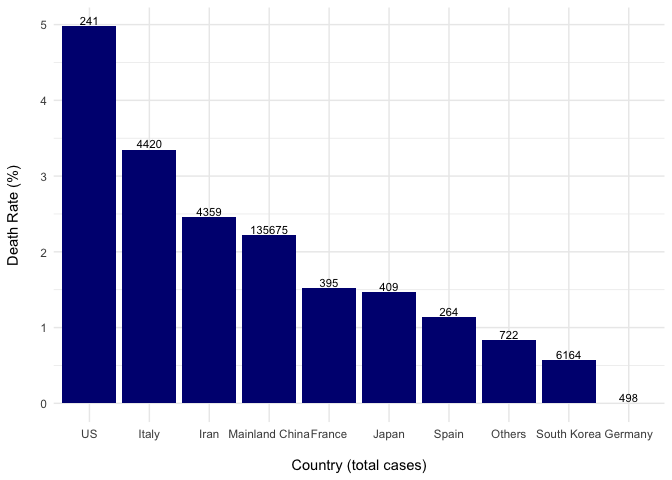

Coronavirus Death Rates
================
Michael Overton

This script analyzes infection data for the 2019 novel Coronavirus COVID-19 (2019-nCoV) epidemic. The raw data is pulled from the Johns Hopkins University Coronavirus repository.

The CSV file is available here <https://github.com/RamiKrispin/coronavirus-csv>

Read in data

Q1) What is the total number of cases of COVID-19 worldwide?

    ## [1] 155031

Q2) How many deaths are associated with COVID-19 worldwide, and what is the death rate?

    ## [1] "2.16%"

Q4) What is the death rate in Mainland China?

    ## [1] "2.22%"

Q5. What are the death rates in Italy, Iran and the US?

    ## [1] "Death rate by country (%)"

    ##   Total   US Iran Italy
    ## 1  2.16 4.98 2.45  3.35

Q6) Compare the death rates among the 10 countries with the highest number of cases.

    ## ── Attaching packages ─────────────────────────────────────────────────────────────────────────────────── tidyverse 1.3.0 ──

    ## ✓ ggplot2 3.2.1     ✓ purrr   0.3.3
    ## ✓ tibble  2.1.3     ✓ dplyr   0.8.4
    ## ✓ tidyr   1.0.2     ✓ stringr 1.4.0
    ## ✓ readr   1.3.1     ✓ forcats 0.5.0

    ## ── Conflicts ────────────────────────────────────────────────────────────────────────────────────── tidyverse_conflicts() ──
    ## x dplyr::filter() masks stats::filter()
    ## x dplyr::lag()    masks stats::lag()

